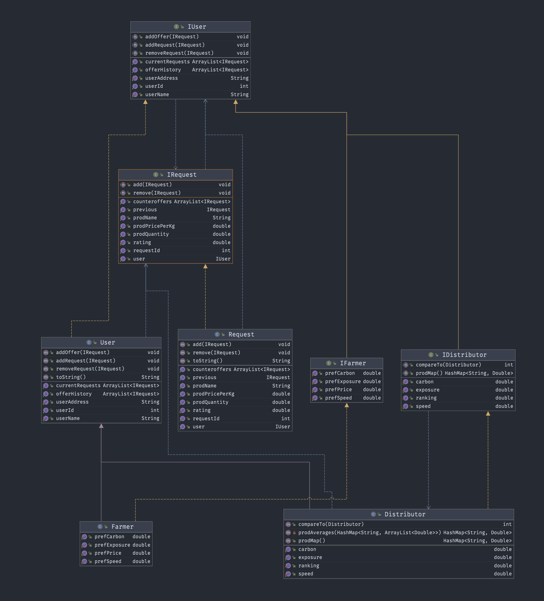
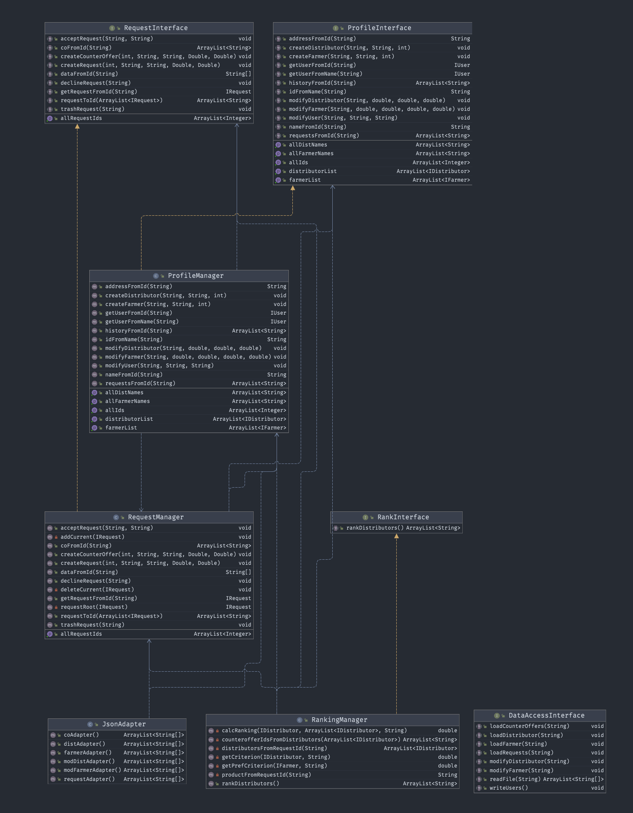
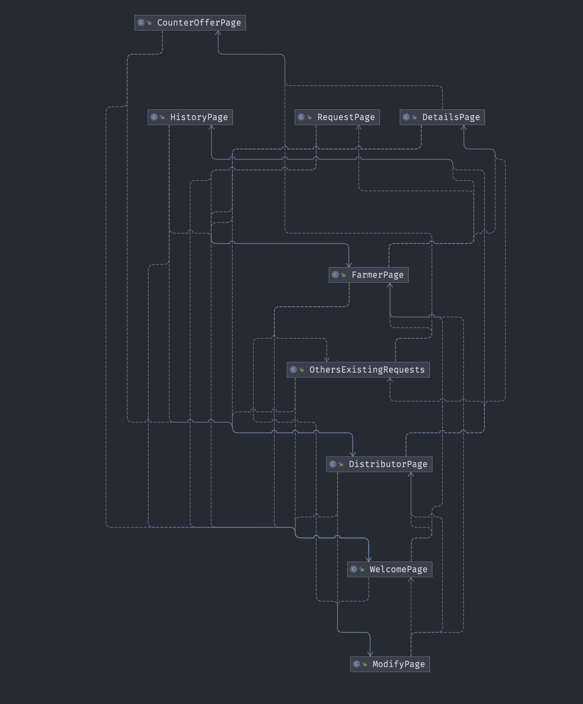

↖️ View Table of Contents Here. Generated by GitHub.

# Design Document

- Details about specification, please view this [file](specification.md)
- Details about the process report, please view this [file](progress_report.md)

## Class Diagram

‼️ Click to see detailed dependencies within packages ‼️

    

    
Entities Packages

        
    

    

    
UseCase Packages

        
    

    

    
Controller Packages

        
    

    

    
Client Packages

        
    

    

    
UI Packages (inside of Client)

        
    

> - For detailed legend for the diagram, please refer to this [picture](https://en.wikipedia.org/wiki/Class_diagram#/media/File:Uml_classes_en.svg)
> - More details for the classes can be seen under [crcCards](../crcCards.md) document (the crcCards does not include the classes for the GUI)

## Design Decisions

#### Composite Design Pattern

At the end of phase 1, we started questioning whether we should use the Composite design pattern. The uses of requests and counteroffers never required us to access the intermediate steps in the tree- counteroffers which had either been declined or themselves contained a counteroffer. In the end, we decided that since one of the main purposes of the design pattern was this kind of navigation, we didn't need to use Composite after all. We instead implemented a simpler system using a few recursive methods in `RequestManager`.

#### Fetching Data

Midway through phase 2, as our refactoring to adhere to Clean Architecture was ongoing, we realized that we would need a way to fetch data (in the form of Strings) to be shown to the user. We contemplated placing a way to fetch data inside `ServiceController`, which was, at the time, the only class inside the Interface Adapters layer. Upon realizing that this would place too much responsibility in a single class, violating the Single Responsibility Principle, we concluded that the only Clean Architecture- and SOLID-adherent way to do this was to create a new class to perform this role. We named it `DataPresenter`: it fetches data from the appropriate place in the code, and has methods in which the Strings from the Use Case layer can be modified if necessary.

## Usage of Clean Architecture

Many of the changes in Phase 2 were made as a result of fixing Clean Architecture violations. For example, our database was in the Controller layer, and we moved it to the outermost layer, refactoring accordingly. As well, instead of passing Entities to the outer layers, we began passing Strings as data transfer objects, while having the use cases handle the conversion between types. We made sure that the Controller layer was not importing Entities, that the UI was not importing UseCase classes, and of course that no class imports concrete classes located in a more outward layer.

## Packaging Strategies

Our packaging strategy has remained the same since Phase 1: we are packaging by layer. However, to ensure clarity, we separated the Frameworks and Drivers layer into two packages: Client and DataBase. Inside Client is a UI folder, as well as a Driver, Facade, and Instantiater. As before, our program isn't separated into clear features, and most classes are used in multiple parts of the program. We have too many 'inside' classes to use the inside/outside packaging strategy, and none of us could think of a logical division into components. It turned out our layers were relatively balanced in phase 2, reinforcing that packaging by layer was the right choice.

## Design Patterns

#### Factory Method

We are using the Factory Method design pattern in creating users and its subclasses. We delay the instantiation of these concrete products in the profile manager with separate factories, with each creator correlating to a unique class of user product.

#### Template

We are using the Template design pattern in createProfileCheck, a method in our Controller, to define the skeleton of our algorithm for creating users.

#### Memento

We are using the Memento design pattern to allow users to undo modifications made to their profile, and revert to a previous state of their profile.

#### Dependency Injection

We are using Dependency Injection with interfaces for our classes to further depend on abstractions rather than each others' details.

#### Facade

We are using the Facade design pattern in order to simplify the interface accessed in our main method.

# Accessibility

## The 7 Principals of Universal Design

#### 1: Equitable Use

Our program aims to to provide the same means of usage for all users with diverse abilities. For the 2 different group of users (Farmer or Distributor), we designed the interfaces to look almost identical, with the only differences being in the parts where different type of users would take on different roles to either create requests (Farmers) or accept open requests (Distributors). We allowed both the Farmers and Distributors to create counter offers as their responses, and accept/decline counteroffers made directly to them. This way, we would avoid segregating or stigmatizing any users. There are no premium features of any kind. Thus, the functionality of privacy, security, and safety are equally available to all users.

#### 2: Flexibility in Use

Our program has multiple features designed to provide choices in methods of use for the users. For example, when creating an account, we allow the user to pick their preferences in ranking the Requests in the market with 4 key attributes (price, exposure, speed, carbon conscience). This way the user gets to define the order in which they read the request and counter offers.

#### 3: Simple and Intuitive Use

The UI for our program is minimal, with no distracting pictures or figures that might cause confusions. The user would be prompted to Sign In or Sign Up immediately after the program starts, which allows the user to get their work done on the fly. We tried our best to select the most user-friendly words with no jargon whatsoever, considering the diverge range of literacy and language skills in our tagged audience. The ranking functionality also ensures that the information lists would be ranged consistently with its importance. We also included multiple error throwers in UI to ensure that our feedback prompts are effective and easy for the user to understand and fix.

#### 4: Perceptible Information

We provided different colorschemes for our program UI (light and dark modes), this helps to increase the legibility of our content. We also choose contrasting colors between the background and the texts for a better user experience. For all of the areas in which we would require user input, we provided clear and concise prompts to make sure the user knows how to navigate properly through our program.

#### 5: Tolerance for Error

As stated before, we provided many error throwers with different prompt messages to ensure that the program runs smoothly. The clean instructions on the prompts would make sure the that the user would know how to fix errors and get back to the program. Our team also worked on a wise range of test cases to provide fail safe features. Below is the mindmap our team used to run our test cases.

#### 6: Low Physical Effort

The program UI window is reasonably sized, so the users are able to view the contents of the program with minimum physical effort. All the pages have included necessary function keys to minimize repetitive actions.

#### 7: Size and Space for Approach and Use

As stated before, our program is reasonably sized, and balances the amount of content to display with minimization of navigation efforts. All elements of the program were arranged with comfortable spaces to provide a clear line of sight to important elements for any user under different circumstances.

## Designated Audience

Given the nature of our program, the designated audience is fairly self-evident: farmers and distributors. Farmers would be anyone that produces produce to sell, whereas distributors are a bit more varied: they could include individuals, farmers' markets, or companies. In fact, though right now our program is tailored to farmers and distributors, there would be minimal effort involved into turning it into a general program for any remote transactions occurring at the root of manufacturing. The only things that would have to change are the types of users (perhaps, **producers** and distributors) the ranking system (if 'exposure' or 'carbon' isn't variable in a particular industry) and the request details (if quantity/price should be by unit rather than kilogram).

## Demographics of Users

Since GitGarden is fundamentally designed as a tool to enable transactions to occur, even with the broadening of our designated audience detailed above, there would still be demographics which have no use for our program. Though we have allowed for individual distributors in the paragraph above, many people simply don't buy anything directly from the source. This is most likely in urban areas (at least for people who aren't managing companies' purchases), but affects people in rural areas too, who might simply not live nearby enough to a farmer to warrant being an individual distributor. Simply put, people who have nothing to sell, or who don't buy directly from producers, will not have a use for our program.

# GitHub usage

Our team used discord as a texting and communication channel, however we took advantage of a couple of GitHub functionalities to help our work flow.

1. We created different branches to work with different sub teams. This helped us to avoid conflict and makes the pull request process easier.

    

2. We have created over 50 pull requests throughout the duration of our project. We tried to leave descriptive comments for each pull request after receiving our phase 1 feedback. We also tried to use the emoji functions to indicate that a person had viewed the pull request. After 2-3 people had reviewed it, we would then merge or close the pull request.

    

3. We also experimented with the issue function, but most of our issues were discussed on discord.

4. Lastly, we used to use the README file as a project management and tracking platform. Refer to this [file](../status.md) now for details.
